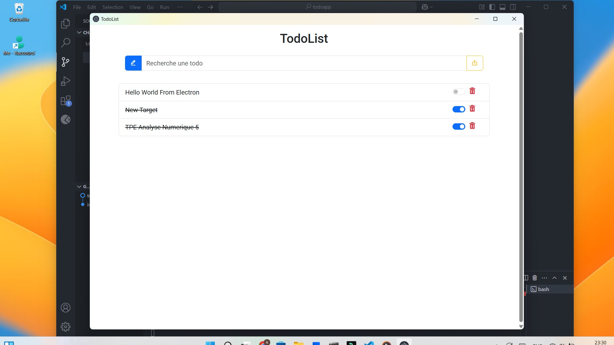

# Todo App

A simple and efficient Todo App to manage your daily tasks.



## Features

- Add, edit, and delete tasks
- Mark tasks as completed
- Filter tasks by status (completed/pending)
- Responsive design for desktop and mobile

## Installation

1. Clone the repository:
    ```bash
    git clone https://github.com/yourusername/todoapp.git
    ```
2. Navigate to the project directory:
    ```bash
    cd todoapp
    ```
3. Install dependencies:
    ```bash
    npm install
    ```

## Usage

1. Start the development server:
    ```bash
    npm start
    ```
2. Open your browser and navigate to:
    ```
    http://localhost:3000
    ```

## Technologies Used

- **Frontend**: VanillasJS, CSS, Bootstrap and BoxIcons
- **Backend**: Node.js, Electron
- **Database**: electron-store

## Contributing

Contributions are welcome! Please follow these steps:

1. Fork the repository.
2. Create a new branch:
    ```bash
    git checkout -b feature-name
    ```
3. Commit your changes:
    ```bash
    git commit -m "Add feature-name"
    ```
4. Push to the branch:
    ```bash
    git push origin feature-name
    ```
5. Open a pull request.

## License

This project is licensed under the [MIT License](LICENSE).

## Contact

For any inquiries or feedback, feel free to reach out:

- Email: ngoufackedgard1@gmail.com
- GitHub: [nmeedg (devit)](https://github.com/nmeedg)